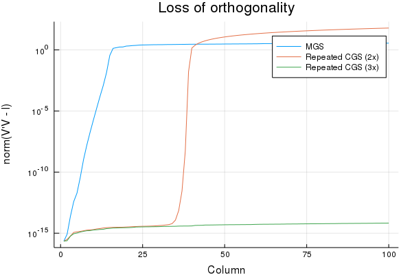

# QRUpdate.jl

[](https://travis-ci.org/haampie/QRUpdate.jl) [](https://codecov.io/gh/haampie/QRUpdate.jl)

Algorithms for updating a QR factorization with Gram-Schmidt.

This package updates a matrix `V = [Q v]` that is orthonormal except for the last column 
`v` into a fully orthonormal matrix.

It computes the vector `q` and `r` and a scalar `ρ` such that `[Q v] = [Q q] * [I r; 0 ρ]`.

Usually `q = v`, so the QR-decomposition is updated in-place.

Further `r = Q' * v` is a projection of `v` on `Q` and `ρ = norm((I - QQ')v)`.

## Methods

- `ClassicalGramSchmidt()`: very unstable, BLAS2
- `ModifiedGramSchmidt()`: quite stable, BLAS1
- `DGKS(tmp, steps)` repeated classical Gram-Schmidt: stable, twice as expensive as MGS, but BLAS2.

The `DGKS` method requires a temporary vector of the same size as `r`. It is usually the
preferred method for stable updates.

## Example

```julia
using LinearAlgebra, Random
using QRUpdate: orthogonalize_and_normalize!, DGKS

# Generate an orthonormal matrix except for the last column
qr_decomp = qr(rand(100, 10))
V = Matrix(qr_decomp.Q)
rand!(view(V, :, 10))

# r_full = [r; ρ]
r_full = rand(10)
V_copy = copy(V)

# Orthonormalize
r = view(r_full, 1:9)
r_full[10], = orthogonalize_and_normalize!(view(V, :, 1:9), view(V, :, 10), r, DGKS(similar(r)))

# Check if the QR decomp holds
@show norm(V'V - I)
# norm(V' * V - I) = 9.620554549865597e-16
@show norm(V_copy[:, 10] - V * r_full)
# norm(V_copy[:, 10] - V * r_full) = 7.676812899781355e-16
```

## Loss of orthogonality

The Hilbert matrix shows how Modified Gram-Schmidt is insufficient to retain orthogonality.



```julia
using Plots
using LinearAlgebra, Random
using QRUpdate: orthogonalize_and_normalize!, DGKS, ModifiedGramSchmidt

hilbert(n, m) = [1 / (i + j) for i = 1:n, j = 1:m]

function using_dgks(n = 100, m = 10, steps = 2)
    V = hilbert(n, m)
    big_r = zeros(m)
    big_tmp = zeros(m)
    residuals = zeros(m)

    for i = 1 : m
        method = DGKS(view(big_tmp, 1:i-1), steps)
        orthogonalize_and_normalize!(view(V, :, 1:i-1), view(V, :, i), view(big_r, 1:i-1), method)

        Q = view(V, :, 1:i)
        residuals[i] = norm(Q' * Q - I)
    end

    return residuals
end

function using_mgs(n = 100, m = 10)
    V = hilbert(n, m)
    big_r = zeros(n)
    residuals = zeros(m)

    for i = 1 : m
        orthogonalize_and_normalize!(view(V, :, 1:i-1), view(V, :, i), view(big_r, 1:i-1), ModifiedGramSchmidt())

        Q = view(V, :, 1:i)
        residuals[i] = norm(Q' * Q - I)
    end

    return residuals
end

function loss_of_orthogonality(n = 1000, m = 100)
    mgs = using_mgs(n, m)
    dgks_2 = using_dgks(n, m, 2)
    dgks_3 = using_dgks(n, m, 3)

    plot(mgs, xlabel = "Column", ylabel = "norm(V'V - I)", title = "Loss of orthogonality", label = "MGS", yscale = :log10)
    plot!(dgks_2, label = "Repeated CGS (2x)")
    plot!(dgks_3, label = "Repeated CGS (3x)")
end
```